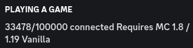
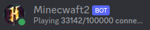
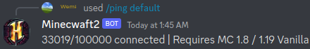
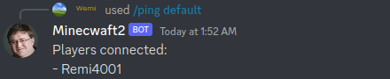
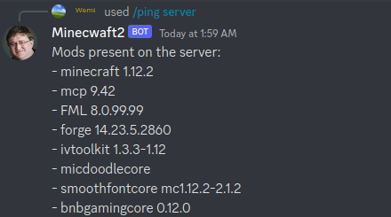

# minecwaft2

Discord bot with multiples capabilities related to Minecraft servers, and that should work on any operating system that supports node.js

Created following the guides from https://discordjs.guide/. You definitely should check this out if you have trouble setting up the bot.

## Features

- Show the current status of a Minecraft server as the bot's status on Discord!
    - Online: server online
    - Idle: server starting
    - Dnd: server offline

    
- Change avatar based on the Minecraft server's icon

    
- Ping any Minecraft server and retrieve playerlist or modlist when possible

    

    

    
- Command to launch a Minecraft server from Discord

    

## Slash commands
- `launch`: Launch a Minecraft server from Discord
- `ping`: Ping a Minecraft server from Discord, can retrieve player count, version, mods and playerlist
- `update`: Manually update the bot's avatar or status

## Installation

Make sure you have [node.js](https://nodejs.org/) installed first, tested with v19.2.0, but any version compatible with discord.js v14 should work fine

1. Clone repo or [download and unzip code from GitHub](https://github.com/Remi4001/minecwaft2/archive/refs/heads/main.zip) into desired folder
    ```sh
    git clone https://github.com/Remi4001/minecwaft2.git
    ```
2. Edit `config.json.example` and rename it to `config.json`
    - **token**: Your application's token from [Discord Developer Portal](https://discord.com/developers/applications)
    - **clientId**: The bot's Discord ID
    - **guildID**: The ID of the Discord server where you want to deploy slash commands (only used if you want to deploy locally, check `deploy-commands.js:25`)
    - **ownerId**: Your personal Discord account's ID (currently unused but could be implemented for owner-only commands)
    - **server**: The Minecraft server to check the status of
        - **type**: `pc` for Java Edition or `pe` for Bedrock Edition (Haven't tested Bedrock so it might need changes in code to work)
        - **ip**: IP of the server
        - **port**: Port of the server
    - **launch**: Launch script(s) for Minecraft server(s)
        - You can add as many scripts as you want, each one must be represented by a different string
        - The string representing the script will be the one used for the `/launch` command in Discord
        - **script**: Name of the file to execute
        - **type, ip, port**: Same as **server** above
    - **interval**: Interval (in ms) for refreshing the bot's status on Discord
3. Install necessary npm dependencies
    ```sh
    npm install
    ```
4. Deploy the slash commands
    ```sh
    node deploy-commands.js
    ```     
    If you need to remove all slash commands use this:
    ```sh
    node deploy-commands.js delete
    ```
5. Start the bot and enjoy!
    ```sh
    node index.js
    ```
    alternatively
    ```sh
    node .
    ```
    Use ctrl+c when you want to stop the bot.